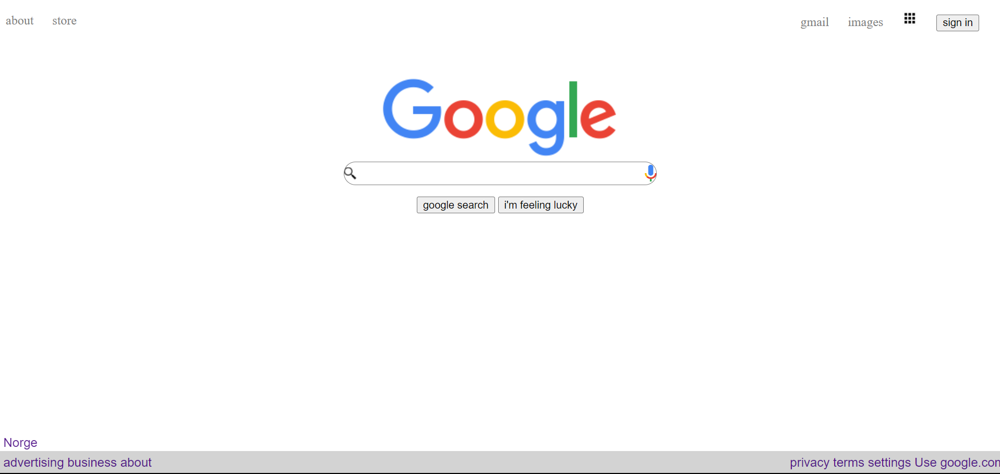

<h1 align="center">CSS FlexBox</h1>
<div align="center">
  <h3>
    <a href="https://github.com/roykenvgs/test">
      Lenken til prosjektet
    </a>
  </h3>
</div>
<!-- TABLE OF CONTENTS -->

## Table of Contents

- [Overview](#overview)
- [Built With](#html and css)
- [Features](#features)
- [How to use](#how-to-use)
- [Contact](#contact)

<!-- OVERVIEW -->
## Overview
Se nederst

### Built With
- [HTML](https://www.w3schools.com/html/)
- [CSS](https://www.w3schools.com/css/default.asp)


## How To Use
Hvilke koder har du brukt? Skrive her: 

```
HTML 
- https://www.w3schools.com/tags/tag_div.ASP  div

CSS 
- https://www.w3schools.com/css/css_boxmodel.asp boxModel
- https://www.w3schools.com/cssref/css_selectors.php seclectotr

```

## Contact
- [GitHub](https://github.com/roykenvgs)
- Epost [Røyken VGS](mailto:emilwest@viken.no)


## Happy coding!

## Forventet resultat


